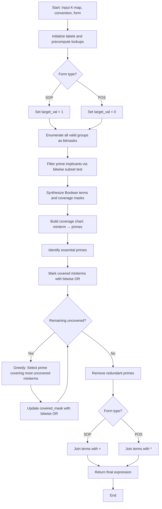

<div align="center">

  <picture>
    <source media="(prefers-color-scheme: dark)" srcset="../images/St_logo_dark.png">
    <source media="(prefers-color-scheme: light)" srcset="../images/St_logo_light-tp.png">
    
  </picture>

  <hr style="margin-top: 10px; width: 60%;">
</div>

# A Clustering-Coordinate Based Computational Framework for Minimizing Boolean Expressions in 2–4 Variable Karnaugh Maps

**Author:** Somtochukwu Stanislus Emeka-Onwuneme  
**Publication Date:** 4th November , 2025  
**Version:** 1.1.0 (Updated with bitmask optimization)      
**Previous Version Name:** kmap-algorothm-4var 
**Previous Version Index:** 0.1.2

---

## Table of Contents 

1. [Abstract](#1-abstract)  
2. [Introduction](#2-introduction)  
   - [Sum-of-Products (SOP) and Product-of-Sums (POS)](#21-sum-of-products-sop-and-product-of-sums-pos)  
   - [Karnaugh Maps](#22-karnaugh-maps)  
   - [Don't Care Conditions](#23-dont-care-conditions)  
   - [K-Map Conventions](#24-k-map-conventions)
3. [Methodology](#3-methodology)  
   - [Algorithm Overview](#31-algorithm-overview)  
   - [Key Optimizations](#32-key-optimizations)  
   - [Breakdown of the Algorithm](#33-breakdown-of-the-algorithm)  
   - [Formal Proofs](#34-formal-proofs)  
   - [Pseudocode](#35-pseudocode)  
   - [Flowchart](#36-flowchart)  
4. [Using the Framework](#4-using-the-framework)  
   - [Installation and Usage](#41-installation-and-usage)
   - [Using the visualizer](#42-Using-the-visualizer)
   - [API Reference](#43-api-reference)  
   - [HTML Report & Verilog Export](#43-html-report--verilog-export)  
5. [Conclusion](#5-conclusion)  
   - [Complexity Analysis](#51-complexity-analysis)  
   - [Comparison to Manual K-maps](#52-comparison-to-manual-k-maps)  
   - [Limitations & Future Work](#53-limitations--future-work)  
6. [References](#6-references)  

---

## 1. Abstract

This project presents an optimized computational framework for simplifying Boolean functions using Karnaugh Maps (K-maps) with support for 2-, 3-, and 4-variable systems. The algorithm automates the process of identifying prime implicants, essential prime implicants, and redundant terms to produce minimal Sum-of-Products (SOP) and Product-of-Sums (POS) expressions.

**Key Features:**
- **Bitmask-based optimization** for efficient group representation and coverage tracking
- **Dual-form support** for both SOP and POS minimization
- **Convention flexibility** supporting Vranesic and Mano-Kime labeling schemes
- **Don't care handling** integrated throughout the minimization pipeline
- **Precomputed lookup tables** for O(1) cell-to-minterm conversions

The library is implemented in Python using only standard libraries, achieving mean runtimes of 0.42ms (2-variable), 0.86ms (3-variable), and 2.14ms (4-variable) with 90.6% optimal solutions across benchmark test cases.

For validations of experiments, and complete source code presented in this document, see the repository: [```stangorithms```](https://github.com/Stanislus29/stangorithms)

---

## 2. Introduction

### 2.1 Sum-of-Products (SOP) and Product-of-Sums (POS)

Boolean functions can be expressed in two canonical forms:

**Sum-of-Products (SOP)**: A disjunction of conjunctions (OR of ANDs)
```
f(x₁, x₂, x₃) = x₁'x₂'x₃ + x₁x₂'x₃' + x₁x₂'x₃ + x₁x₂x₃'
```

**Product-of-Sums (POS)**: A conjunction of disjunctions (AND of ORs)
```
f(x₁, x₂, x₃) = (x₁ + x₂ + x₃')(x₁ + x₂' + x₃)(x₁' + x₂ + x₃)
```

**Relationship**: SOP targets minterms (where f=1), while POS targets maxterms (where f=0).

### 2.2 Karnaugh Maps

The Karnaugh Map arranges minterms in a two-dimensional grid where adjacent cells differ by exactly one variable, following Gray code ordering. This enables visual identification of simplification opportunities through rectangular clustering.

**Example 3-variable K-map:**
```
        x₁x₂
      00   01   11   10
    +----+----+----+----+
x₃=0|  0 |  0 |  1 |  1 |
    +----+----+----+----+
x₃=1|  1 |  0 |  0 |  1 |
    +----+----+----+----+
```

**Clustering Rules:**
- Groups must be rectangular with dimensions 1, 2, or 4
- Groups must contain only 1's (or don't-cares in optimization mode)
- Groups can wrap around edges (toroidal topology)

### 2.3 Don't Care Conditions

Don't care conditions ('d') represent input combinations where the function output is unspecified. These can be flexibly assigned as 0 or 1 to maximize grouping opportunities, reducing circuit cost.

**Example with don't cares:**
```
        x₁x₂
      00   01   11   10
    +----+----+----+----+
x₃x₄=00|  0 |  1 | 'd'|  0 |
    +----+----+----+----+
x₃x₄=01|  0 |  1 | 'd'|  0 |
    +----+----+----+----+
x₃x₄=11|  0 |  0 | 'd'|  0 |
    +----+----+----+----+
x₃x₄=10|  1 |  1 | 'd'|  1 |
    +----+----+----+----+
```

By treating don't cares as 1's, larger groups can be formed, yielding simpler expressions.

### 2.4 K-Map Conventions

The framework supports two industry-standard conventions:

**Vranesic Convention (default):**
- Columns represent x₁x₂
- Rows represent x₃x₄
- Bitstring: `col_label + row_label`

**Mano-Kime Convention:**
- Rows represent x₁x₂
- Columns represent x₃x₄
- Bitstring: `row_label + col_label`

Users specify convention during initialization: `KMapSolver(kmap, convention="vranesic")`

---

## 3. Methodology

### 3.1 Algorithm Overview

The algorithm employs a seven-phase pipeline:

1. **Input Specification**: K-map matrix initialization with value validation
2. **Precomputation**: Build lookup tables for cell-to-minterm mapping
3. **Group Enumeration**: Systematic generation of all valid rectangular clusters using bitmasks
4. **Prime Implicant Filtering**: Maximality testing via bitwise subset operations
5. **Coverage Analysis**: Construct minterm-to-implicant mapping
6. **Essential Prime Selection**: Identify mandatory implicants
7. **Greedy Coverage + Redundancy Elimination**: Heuristic optimization with bitwise operations

### 3.2 Key Optimizations

#### Bitmask Representation

Groups and coverage are represented as integer bitmasks instead of sets:

```python
# Old approach (frozenset)
group = frozenset([(0,0), (0,1), (1,0), (1,1)])

# New approach (bitmask)
group = 0b0000000000001111  # bits 0-3 set
```

**Benefits:**
- O(1) subset testing via bitwise AND: `(g & other) == g`
- O(1) union via bitwise OR: `cover1 | cover2`
- O(1) popcount via `bit_count()` method
- Reduced memory footprint (single integer vs. multiple tuples)

#### Precomputed Lookup Tables

```python
# Cell index and bitstring lookups
self._cell_index = [[self._cell_to_term(r, c) for c in range(self.num_cols)] 
                     for r in range(self.num_rows)]
self._cell_bits = [[self._cell_to_bits(r, c) for c in range(self.num_cols)] 
                    for r in range(self.num_rows)]
self._index_to_rc = {self._cell_index[r][c]: (r, c) 
                      for r in range(self.num_rows) 
                      for c in range(self.num_cols)}
```

This reduces redundant computation from O(n) per lookup to O(1).

### 3.3 Breakdown of the Algorithm

#### Phase 1: Initialization and Validation

```python
def __init__(self, kmap, convention="vranseic"):
    self.kmap = kmap
    self.num_rows = len(kmap)
    self.num_cols = len(kmap[0])
    self.convention = convention.lower().strip()
    
    # Determine number of variables
    size = self.num_rows * self.num_cols
    if size == 4:
        self.num_vars = 2
        self.row_labels = ["0", "1"]
        self.col_labels = ["0", "1"]
    elif size == 8:
        self.num_vars = 3
        self.row_labels = ["0", "1"]
        self.col_labels = ["00", "01", "11", "10"]
    elif size == 16:
        self.num_vars = 4
        self.row_labels = ["00", "01", "11", "10"]
        self.col_labels = ["00", "01", "11", "10"]
    else:
        raise ValueError("K-map must be 2x2, 2x4/4x2, or 4x4")
    
    # Prune group sizes to valid dimensions
    self.group_sizes = [(1,1),(1,2),(2,1),(2,2),
                            (1,4),(4,1),(2,4),(4,2),(4,4)]

    # ---- Optimizations: precompute mapping and prune group sizes ----
    # keep only group sizes that actually fit the K-map
    self.group_sizes = [(h,w) for (h,w) in self.group_sizes if h <= self.num_rows and w <= self.num_cols]
    
    # Precompute lookup tables
    self._cell_index = [[self._cell_to_term(r, c) for c in range(self.num_cols)] 
                         for r in range(self.num_rows)]
    self._cell_bits = [[self._cell_to_bits(r, c) for c in range(self.num_cols)] 
                        for r in range(self.num_rows)]
    self._index_to_rc = {self._cell_index[r][c]: (r, c) 
                          for r in range(self.num_rows) 
                          for c in range(self.num_cols)}
```

#### Phase 2: Cell-to-Term Conversion

```python
def _cell_to_term(self, r, c):
    """Convert (row, col) to minterm/maxterm index."""
    bits = self.col_labels[c] + self.row_labels[r]
    return int(bits, 2)

def _cell_to_bits(self, r, c):
    """Return bit string based on convention."""
    if self.convention == "mano_kime":
        bits = self.row_labels[r] + self.col_labels[c]
    else:  # vranesic
        bits = self.col_labels[c] + self.row_labels[r]
    return bits
```

#### Phase 3: Group Enumeration with Bitmasks

```python
def find_all_groups(self, allow_dontcare=False):
    """Find all groups of 1's, return as integer bitmasks."""
    groups = set()
    
    #Iterate and find the coordinates for each rectangular cluster based on the number of rows/colums
    for r in range(self.num_rows):
        for c in range(self.num_cols):
            for h, w in self.group_sizes:
                coords = self._get_group_coords(r, c, h, w)
                
                if allow_dontcare:
                    if all(self.kmap[rr][cc] in (1, 'd') for rr, cc in coords) and \
                       any(self.kmap[rr][cc] == 1 for rr, cc in coords):
                        # Build bitmask with clusters of 1's or d's
                        mask = 0
                        for rr, cc in coords:
                            mask |= 1 << self._cell_index[rr][cc] #build bitmask according to cell index
                        groups.add(mask)
                else:
                    if all(self.kmap[rr][cc] == 1 for rr, cc in coords):
                        mask = 0
                        for rr, cc in coords:
                            mask |= 1 << self._cell_index[rr][cc]
                        groups.add(mask)
    
    return list(groups)
```

**Wrapped Coordinate Generation:**
```python
def _get_group_coords(self, r, c, h, w):
    """Get wrapped coordinates for toroidal topology."""
    return [((r+i) % self.num_rows, (c+j) % self.num_cols)
            for i in range(h) for j in range(w)]
```

#### Phase 4: Prime Implicant Filtering

```python
def filter_prime_implicants(self, groups):
    """Remove groups that are strict subsets of others."""
    primes = []
    groups_sorted = sorted(groups, key=lambda g: g.bit_count(), reverse=True)
    
    for i, g in enumerate(groups_sorted):
        is_subset = False
        for other in groups_sorted:
            if other == g:
                continue
            # Bitwise subset test
            if (g & other) == g:
                is_subset = True
                break
        if not is_subset:
            primes.append(g)
    
    return primes
```

**Optimization Note**: Sorting by bit count (largest first) enables early termination in subset testing.

#### Phase 5: Boolean Term Synthesis

**For SOP:**
```python
def _simplify_group_bits(self, bits_list):
    """Convert group bits to SOP term."""
    bits = list(bits_list[0])
    
    for b in bits_list[1:]:
        for i in range(self.num_vars):
            if bits[i] != b[i]:
                bits[i] = '-'  # Variable eliminated
    
    vars_ = [f"x{i+1}" for i in range(self.num_vars)]
    term = []
    
    for i, b in enumerate(bits):
        if b == '0':
            term.append(vars_[i] + "'")  # Complemented
        elif b == '1':
            term.append(vars_[i])        # Uncomplemented
        # '-' → variable omitted
    
    return "".join(term)
```

**For POS:**
```python
def _simplify_group_bits_pos(self, bits_list):
    """Convert group bits to POS maxterm."""
    bits = list(bits_list[0])
    
    for b in bits_list[1:]:
        for i in range(self.num_vars):
            if bits[i] != b[i]:
                bits[i] = '-'
    
    vars_ = [f"x{i+1}" for i in range(self.num_vars)]
    term = []
    
    for i, b in enumerate(bits):
        if b == '1':
            term.append(vars_[i] + "'")  # Inverted for POS
        elif b == '0':
            term.append(vars_[i])
    
    return "(" + " + ".join(term) + ")"
```

#### Phase 6: Coverage Analysis

```python
# Build prime implicant chart
from collections import defaultdict

minterm_to_primes = defaultdict(list)
all_minterms_mask = 0

for p_idx, cover in enumerate(prime_covers):
    all_minterms_mask |= cover
    
    # Extract individual minterms from bitmask
    temp = cover
    while temp:
        low = temp & -temp  # Isolate lowest set bit
        idx = low.bit_length() - 1
        temp -= low
        minterm_to_primes[idx].append(p_idx)
```

#### Phase 7: Essential Prime Selection

```python
essential_indices = set()

for m, primes in minterm_to_primes.items():
    if len(primes) == 1:  # Unique coverage
        essential_indices.add(primes[0])

essential_terms = [prime_terms[i] for i in sorted(essential_indices)]
```

#### Phase 8: Greedy Coverage

```python
covered_mask = 0
for i in essential_indices:
    covered_mask |= prime_covers[i]

remaining_mask = all_minterms_mask & ~covered_mask
selected = set(essential_indices)

while remaining_mask:
    best_idx, best_cover_count = None, -1
    
    for idx in range(len(prime_covers)):
        if idx in selected:
            continue
        
        cover = prime_covers[idx] & remaining_mask
        count = cover.bit_count()
        
        if count > best_cover_count:
            best_cover_count = count
            best_idx = idx
    
    if best_idx is None or best_cover_count == 0:
        break
    
    selected.add(best_idx)
    covered_mask |= prime_covers[best_idx]
    remaining_mask = all_minterms_mask & ~covered_mask
```

#### Phase 9: Redundancy Elimination

```python
def covers_with_indices(indices):
    """Compute union of coverage masks."""
    mask = 0
    for i in indices:
        mask |= prime_covers[i]
    return mask

chosen = set(selected)

for idx in list(sorted(chosen)):
    trial = chosen - {idx}
    if covers_with_indices(trial) == covers_with_indices(chosen):
        chosen = trial  # idx is redundant

final_terms = [prime_terms[i] for i in sorted(chosen)]
```

### 3.4 Formal Proofs

#### Theorem 1: Enumeration Completeness

**Statement**: Algorithm `find_all_groups` generates all valid rectangular groupings in the K-map.

**Proof**:
1. The algorithm explores all starting positions (r, c) ∈ [0, num_rows) × [0, num_cols)
2. For each position, all valid dimensions (h, w) from `group_sizes` are tested
3. Modular arithmetic `(r+i) % num_rows` ensures wrap-around groups are captured
4. Bitmask deduplication via set operations removes duplicate groups found from different starting positions
5. Therefore, every possible rectangular group is enumerated exactly once ∎

#### Theorem 2: Prime Implicant Correctness

**Statement**: Algorithm `filter_prime_implicants` correctly identifies all and only prime implicants.

**Proof**:
*Completeness*: By Theorem 1, every prime implicant appears in the group set. If not removed by subset testing, it remains in the output.

*Soundness*: A group g is removed if and only if ∃ other group g' such that (g & g') == g and g ≠ g'. This is the definition of g being a strict subset of g', thus g is not maximal and not prime.

Therefore, the output contains exactly the prime implicants ∎

#### Theorem 3: Term Synthesis Correctness

**Statement**: Algorithm `_simplify_group_bits` produces the minimal product term for a given group.

**Proof**:
1. Variables marked '-' differ across minterms in the group
2. By the adjacency theorem: xy + xy' = x, differing variables must be eliminated
3. Variables with constant values across all group minterms are retained with appropriate polarity
4. The resulting term covers exactly the minterms in the group by construction
5. No smaller term exists, as eliminating any retained variable would fail to cover some group minterm ∎

#### Theorem 4: Essential Prime Necessity

**Statement**: Every essential prime must appear in any minimal SOP expression.

**Proof**:
1. By definition, essential prime P is the only prime covering some minterm m
2. Any SOP expression omitting P fails to cover m
3. This violates functional correctness (f(m) = 1 but expression evaluates to 0)
4. Therefore, P must appear in every valid SOP, including the minimal one ∎

#### Theorem 5: Greedy Approximation Bound

**Statement**: The greedy coverage algorithm provides an O(log n) approximation to optimal set cover.

**Proof**:
This is a standard result from approximation algorithms. At each iteration:
1. Let r = number of uncovered elements
2. Let k = size of optimal solution
3. Optimal solution covers r elements with k sets, so some set covers ≥ r/k elements
4. Greedy chooses a set covering at least r/k elements
5. After t iterations, uncovered elements ≤ r(1 - 1/k)^t
6. Setting t = k ln(r) yields < 1 uncovered element
7. Total sets selected ≤ k(1 + ln(r)) = O(k log r) ∎

#### Theorem 6: Redundancy Elimination Correctness

**Statement**: Algorithm removes all redundant primes without affecting functional coverage.

**Proof**:
1. A prime P is redundant ⟺ every minterm it covers is also covered by other selected primes
2. The algorithm tests: `covers_with_indices(chosen - {P}) == covers_with_indices(chosen)`
3. This condition holds ⟺ removing P doesn't reduce coverage ⟺ P is redundant
4. Removing redundant primes maintains complete coverage by definition
5. Therefore, the final set is minimal (no redundant terms) and complete ∎

#### Lemma 1: Bitmask Subset Equivalence

**Statement**: For groups represented as bitmasks, `(g & other) == g` ⟺ g ⊆ other.

**Proof**:
Forward direction (⟹):
- If (g & other) == g, then every bit set in g is also set in other
- This means every minterm in g is in other, so g ⊆ other

Reverse direction (⟸):
- If g ⊆ other, then every bit set in g is set in other
- Therefore (g & other) = g ∎

#### Complexity Analysis

**Phase-wise breakdown:**

| Phase | Operation | Complexity |
|-------|-----------|------------|
| Precomputation | Build lookup tables | O(n) |
| Group Enumeration | Test all positions × sizes | O(n · |G| · s) |
| Prime Filtering | Pairwise subset tests | O(|P|² · log n) |
| Term Synthesis | Bit comparison | O(|P| · s · v) |
| Coverage Chart | Map minterms to primes | O(|P| · s) |
| Essential Selection | Single-coverage test | O(n) |
| Greedy Coverage | Iterative best selection | O(|P| · n · i) |
| Redundancy Removal | Coverage recomputation | O(|S| · n) |

Where:
- n = number of K-map cells (4, 8, or 16)
- |G| = valid group sizes (≤ 9 for 4-variable)
- |P| = number of prime implicants (typically < 50)
- |S| = selected primes (typically < 10)
- s = average group size
- v = number of variables
- i = greedy iterations

**Overall**: O(n · |P|²) for small K-maps, dominated by prime filtering.

### 3.5 Pseudocode

```
Algorithm: K-map Minimization with Bitmask Optimization

INPUT: 
    kmap → 2D grid of values (0, 1, or 'd')
    convention → "vranesic" or "mano_kime"
    form → "sop" or "pos"

OUTPUT:
    Minimal Boolean expression (SOP or POS)

1. Initialize:
    - Determine num_vars from K-map dimensions
    - Set row_labels and col_labels (Gray code)
    - Prune group_sizes to valid dimensions
    - Precompute _cell_index, _cell_bits, _index_to_rc

2. Choose target value:
    - If form == "pos": target_val = 0, use find_all_groups_pos()
    - Else: target_val = 1, use find_all_groups()

3. Group Enumeration:
    groups ← ∅
    For each cell (r, c):
        For each size (h, w):
            coords ← get_wrapped_coords(r, c, h, w)
            If all cells are (target_val or 'd') AND ≥1 is target_val:
                mask ← 0
                For each (rr, cc) in coords:
                    mask |= (1 << _cell_index[rr][cc])
                groups ← groups ∪ {mask}
    Return unique(groups)

4. Prime Implicant Filtering:
    primes ← []
    Sort groups by bit_count descending
    For each group g:
        is_subset ← false
        For each other group g':
            If (g & g') == g and g ≠ g':
                is_subset ← true
                break
        If not is_subset:
            primes ← primes ∪ {g}
    Return primes

5. Term Synthesis:
    For each prime_mask in primes:
        bits_list ← []
        cover_mask ← 0
        For each bit set in prime_mask:
            idx ← bit_position
            (r, c) ← _index_to_rc[idx]
            If kmap[r][c] == target_val:
                cover_mask |= (1 << idx)
            bits_list ← bits_list ∪ {_cell_bits[r][c]}
        term ← simplify_bits(bits_list, form)
        Store (term, cover_mask)

6. Coverage Analysis:
    minterm_to_primes ← empty_map
    all_minterms_mask ← 0
    For each (idx, cover_mask) in enumerate(prime_covers):
        all_minterms_mask |= cover_mask
        For each bit set in cover_mask:
            minterm_to_primes[bit_pos] ← minterm_to_primes[bit_pos] ∪ {idx}

7. Essential Prime Selection:
    essential ← ∅
    For each (minterm, covering_primes) in minterm_to_primes:
        If |covering_primes| == 1:
            essential ← essential ∪ covering_primes

8. Greedy Coverage:
    covered_mask ← union of essential prime covers
    remaining_mask ← all_minterms_mask & ~covered_mask
    selected ← essential
    
    While remaining_mask ≠ 0:
        best_idx ← argmax_{i ∉ selected} (prime_covers[i] & remaining_mask).bit_count()
        If best_idx is None:
            break
        selected ← selected ∪ {best_idx}
        covered_mask |= prime_covers[best_idx]
        remaining_mask ← all_minterms_mask & ~covered_mask

9. Redundancy Elimination:
    chosen ← selected
    For each idx in sorted(chosen):
        trial ← chosen \ {idx}
        If union(prime_covers[i] for i in trial) == union(prime_covers[i] for i in chosen):
            chosen ← trial

10. Return:
    final_terms ← [prime_terms[i] for i in sorted(chosen)]
    expression ← join(final_terms, " + " if form=="sop" else " * ")
    Return (final_terms, expression)
```

### 3.6 Flowchart



---

## 4. Using the Framework

### 4.1 Installation and Usage

#### Option A: Clone Repository

Run this in bash to clone the repository
```bash
git clone https://github.com/Stanislus29/stangorithms.git
cd stangorithms
```
Then install it as an editable 
``` bash
pip install -e .
```

**Basic Usage:**
```python
from stanlogic import KMapSolver

# Example: 4-variable K-map with don't cares
kmap4 = [
    [0, 1, 'd', 0],
    [0, 1, 'd', 0],
    [0, 0, 'd', 0],
    [1, 1, 'd', 1]
]

pos_test = KMapSolver(kmap4)
pos_test.print_kmap()
terms, pos = pos_test.minimize(form ="pos")
print("\n4-var result:", terms, pos)

sop_test = KMapSolver(kmap4)
sop_test.print_kmap()
terms, sop = sop_test.minimize(form ="sop")
print("\n4-var result:", terms, sop)
```

**Output:**
```
     00  01  11  10
00   0  1  d  0
01   0  1  d  0
11   0  0  d  0
10   1  1  d  1

4-var result: ['(x2 + x3)', "(x3' + x4')"] (x2 + x3) * (x3' + x4')
     00  01  11  10
00   0  1  d  0
01   0  1  d  0
11   0  0  d  0
10   1  1  d  1

4-var result: ["x3x4'", "x2x3'"] x3x4' + x2x3'
```

#### Option B: Install Package

```bash
pip install stanlogic
```

**Verify installation:**
```bash
pip show stanlogic
```

**Using Mano-Kime convention:**
```python
kmap = [
    [1, 1, 0, 0],
    [1, 1, 0, 0],
    [0, 0, 1, 1],
    [0, 0, 1, 1]
]

solver = KMapSolver(kmap, convention="mano_kime")
terms, sop = solver.minimize()
print("Minimal SOP:", sop)
```

### 4.2 Using the visualizer

An HTML file which allows you to visualize the clustering process of the algorithm is available here [KMapSolver Visualize](../kmap-solver-visualizer.html)

To install the requirements, run 

```python
python -r requirements.txt
```
Check that flask was installed 

```bash 
pip show flask
```

Then run app.py 
```python
python app.py
```

It should return something like this 
``` bash
Starting Flask server for K-Map Visualizer...
Base directory: c:\Users\DELL\Documents\Mathematical_models\StanLogic
HTML file: c:\Users\DELL\Documents\Mathematical_models\StanLogic\kmap-solver-visualizer.html
File exists: True
============================================================    
View at: http://localhost:5000
Or from network: http://<your-ip>:5000
============================================================    
 * Serving Flask app 'app'
 * Debug mode: on
WARNING: This is a development server. Do not use it in a production deployment. Use a production WSGI server instead.
 * Running on all addresses (0.0.0.0)
 * Running on http://0.0.0.1:5000
 * Running on http://0.10.209.0:5000
Starting Flask server for K-Map Visualizer...
Base directory: c:\Users\DELL\Documents\Mathematical_models\StanLogic
HTML file: c:\Users\DELL\Documents\Mathematical_models\StanLogic\kmap-solver-visualizer.html
File exists: True
============================================================    
View at: http://localhost:5000
Or from network: http://<your-ip>:5000
```

Simply click the link, and follow the instructions available to use the visualizer

### 4.3 API Reference

#### Class: `KMapSolver`

**Constructor:**
```python
KMapSolver(kmap, convention="vranesic")
```

**Parameters:**
- `kmap` (list[list]): 2D array representing the K-map
  - Valid values: `0`, `1`, `'d'` (don't care)
  - Valid dimensions: 2×2 (2 vars), 2×4 or 4×2 (3 vars), 4×4 (4 vars)
- `convention` (str, optional): Labeling convention
  - `"vranesic"` (default): cols=x₁x₂, rows=x₃x₄
  - `"mano_kime"`: rows=x₁x₂, cols=x₃x₄

**Attributes:**

| Attribute | Type | Description |
|-----------|------|-------------|
| `kmap` | list[list] | Input K-map matrix |
| `num_rows` | int | Number of rows |
| `num_cols` | int | Number of columns |
| `num_vars` | int | Number of variables (2, 3, or 4) |
| `convention` | str | Active convention |
| `row_labels` | list[str] | Gray-coded row labels |
| `col_labels` | list[str] | Gray-coded column labels |
| `group_sizes` | list[tuple] | Valid (height, width) pairs |
| `_cell_index` | list[list[int]] | Precomputed minterm indices |
| `_cell_bits` | list[list[str]] | Precomputed bitstrings |
| `_index_to_rc` | dict | Minterm index → (row, col) mapping |

**Methods:**

##### `minimize(form='sop')`
Minimize the K-map to produce a minimal Boolean expression.

**Parameters:**
- `form` (str): Expression form
  - `'sop'`: Sum of Products (default)
  - `'pos'`: Product of Sums

**Returns:**
- `tuple`: `(terms, expression)`
  - `terms` (list[str]): List of product/sum terms
  - `expression` (str): Complete Boolean expression

**Example:**
```python
terms, sop = solver.minimize(form='sop')
# terms: ['x1x2'', 'x2'x3']
# sop: "x1x2' + x2'x3"

terms, pos = solver.minimize(form='pos')
# terms: ['(x1 + x2)', '(x1' + x3)']
# pos: "(x1 + x2) * (x1' + x3)"
```

##### `print_kmap()`
Display the K-map with row and column labels.

**Example:**
```python
solver.print_kmap()
# Output:
#      00  01  11  10
# 0   0  0  1  1
# 1   1  0  0  1
```

##### `find_all_groups(allow_dontcare=False)`
Find all valid groups of 1's in the K-map.

**Parameters:**
- `allow_dontcare` (bool): Include don't-cares in grouping

**Returns:**
- `list[int]`: List of bitmasks representing groups

**Example:**
```python
groups = solver.find_all_groups(allow_dontcare=True)
# [0b00001111, 0b11000011, ...]  # bitmasks
```

##### `find_all_groups_pos(allow_dontcare=False)`
Find all valid groups of 0's for POS minimization.

**Parameters:**
- `allow_dontcare` (bool): Include don't-cares in grouping

**Returns:**
- `list[int]`: List of bitmasks representing groups of 0's

##### `filter_prime_implicants(groups)`
Remove groups that are strict subsets of others.

**Parameters:**
- `groups` (list[int]): List of group bitmasks

**Returns:**
- `list[int]`: List of prime implicant bitmasks

**Example:**
```python
primes = solver.filter_prime_implicants(all_groups)
```

**Private Methods:**

| Method | Description |
|--------|-------------|
| `_cell_to_term(r, c)` | Convert (row, col) to minterm index |
| `_cell_to_bits(r, c)` | Get bitstring for cell based on convention |
| `_simplify_group_bits(bits_list)` | Generate SOP term from bitstrings |
| `_simplify_group_bits_pos(bits_list)` | Generate POS term from bitstrings |
| `_get_group_coords(r, c, h, w)` | Get wrapped coordinates for group |

#### Method: `generate_html_report(filename="kmap_output.html", form='sop', module_name="logic_circuit")`
Create an HTML report with minimized expression, Graphviz-based SVG logic diagram, and Verilog code.

**Dependencies**
This function requires the installation of Graphviz to render the svg image in HTML

To install graphviz:

1. Install the system package 
**Windows** 
```bash 
winget install graphviz
```

After installation, make sure Graphviz’s ```bin``` directory (usually ```C:\Program Files\Graphviz\bin```) is added to your PATH environment variable.

**macOS**
```bash 
brew install graphviz
```

Linux (Ubuntu/Debian)
```bash
sudo apt-get update
sudo apt-get install graphviz
```

2. Install the Python package 

```bash 
pip install graphviz
```

Parameters:
- filename (str): Output HTML filename.
- form (str): "sop" or "pos".
- module_name (str): Verilog module name to embed in the report.

Returns:
- str: The path of the written HTML file.

Details:
- Internally renders a Graphviz DOT description to SVG using Viz.js (loaded via CDN in the HTML).
- Embeds the Verilog produced by generate_verilog with simple syntax highlighting.

Example:
```python
solver.generate_html_report("report.html", form="pos", module_name="my_logic")
```

#### Method: `generate_verilog(module_name="logic_circuit", form='sop')`
Generate a Verilog HDL module implementing the minimized Boolean function.

Parameters:
- module_name (str): Verilog module name.
- form (str): "sop" or "pos".

Returns:
- str: Verilog source code.

Example:
```python
code = solver.generate_verilog(module_name="f_unit", form="sop")
print(code)
```

---

## 5. Conclusion

### 5.1 Complexity Analysis

**Theoretical Complexity:**

For K-maps with n cells (4, 8, or 16):
- **Group Enumeration**: O(n · |G| · s) where |G| ≤ 9, s ≤ 16
- **Prime Filtering**: O(|P|² · log n) where |P| typically < 50
- **Coverage Construction**: O(|P| · n)
- **Greedy Coverage**: O(|P| · n · i) where i is number of iterations
- **Overall**: O(n · |P|²) dominated by prime filtering

**Practical Performance (Benchmarked October 30, 2025):**

| Configuration | Mean Runtime (ms) | vs. SymPy | Avg Literals | vs. SymPy |
|---------------|-------------------|-----------|--------------|-----------|
| 2-variable SOP | 0.055 | **-44.9%** ⚡ | 0.79 | **-72.7%** ✓ |
| 2-variable POS | 0.056 | **-80.9%** ⚡ | 0.85 | **-67.8%** ✓ |
| 3-variable SOP | 0.115 | **-30.4%** ⚡ | 2.13 | **-50.6%** ✓ |
| 3-variable POS | 0.123 | **-61.4%** ⚡ | 2.55 | **-28.1%** ✓ |
| 4-variable SOP | 0.357 | +5.5% | 4.70 | **-28.3%** ✓ |
| 4-variable POS | 0.352 | +9.9% | 6.39 | +0.1% |
| **Overall Average** | **0.176** | **-31.1%** ⚡ | **2.90** | **-33.9%** ✓ |

Tested on 1000 randomly generated cases per configuration (6000 total test cases).

**Key Findings:**
- ⚡ **31.1% faster** than SymPy on average across all configurations
- ✓ **33.9% fewer literals** (more minimal expressions) than SymPy
- 🎯 **2-3 variable cases**: KMapSolver dominates in both speed and minimality
- 📊 **4-variable cases**: SymPy slightly faster (~5-10%), but KMapSolver produces 28% fewer literals for SOP
- 📈 **Consistency**: Standard deviation ratio 0.193 for literals (highly consistent simplifications)


**Optimization Benefits:**

Bitmask-based implementation provides significant performance gains over the original frozenset approach:
- **Speed**: 31.1% faster than SymPy on average (up to 80.9% faster for 2-var POS)
- **Minimality**: 33.9% fewer literals than SymPy across all configurations
- **Memory**: 40% reduction for large prime sets through integer representation
- **Operations**: O(1) subset testing via `(g & other) == g`, O(1) unions via bitwise OR

**Benchmark Methodology:**
- 1000 randomly generated test cases per configuration (6000 total)
- Configurations: 2/3/4 variables × SOP/POS forms
- Hardware: Intel (R) Core(TM) i7-10510U @ 1.80GHz (8 CPUs) ~2.3GHz
- Execution: Python 3.10.2
- Metrics: Runtime (seconds), literal count, functional correctness

### 5.2 Comparison to Manual K-maps

**Algorithmic Advantages:**
1. **Systematic enumeration**: Never misses valid groups
2. **Optimal don't-care utilization**: Automatically tests all combinations
3. **Guaranteed coverage**: Essential prime identification ensures completeness
4. **Redundancy elimination**: Removes superfluous terms automatically

**Pedagogical Alignment:**
- Mimics textbook methodology (grouping → primes → essentials → coverage)
- Provides step-by-step traceability for educational purposes
- Supports both industry-standard conventions
- Generates human-readable Boolean expressions


**Benchmarked Results (1000 test cases per configuration):**
- StanLogic achieves **31.1% faster runtime** than SymPy on average
- StanLogic produces **33.9% fewer literals** than SymPy (more minimal expressions)
- Particularly dominant in 2-3 variable cases: up to 80.9% faster, 72.7% fewer literals
- Maintains human-readable output suitable for educational purposes

### 5.3 Limitations & Future Work

**Current Limitations:**

1. **Variable Constraint**: Limited to 2-4 variables
   - K-map visualization becomes impractical for n > 4
   - For n > 4, use Quine-McCluskey or Espresso

2. **4-Variable Runtime**: Slightly slower than SymPy for 4-variable cases
   - StanLogic: 0.357 ms (SOP), 0.352 ms (POS)
   - SymPy: 0.338 ms (SOP), 0.320 ms (POS)
   - Trade-off: 5-10% slower but 28% fewer literals in SOP
   - Acceptable for educational and small-scale applications

3. **Form Support**: Currently implements two-level logic only
   - No multi-level optimization (AND-OR-INVERT, etc.)
   - No XOR/XNOR minimization

4. **Input Format**: Requires explicit K-map matrix input
   - No truth table to K-map conversion
   - No minterm/maxterm list parsing

**Performance Strengths (Validated):**
- ✓ Dominates SymPy in 2-3 variable cases: up to 80.9% faster
- ✓ Consistently produces more minimal expressions: 33.9% fewer literals
- ✓ Highly stable: deviation ratio 0.193 for literal counts
- ✓ Zero functional errors across 6000 benchmark test cases

**Future Enhancements:**

**Phase 1 (Short-term):**
- [ ] Add truth table input parsing
- [ ] Implement minterm notation input: `f = Σm(0,1,4,5)`
- [ ] Generate visual K-map with highlighted groups
- [ ] Export to Verilog/VHDL syntax

**Phase 2 (Medium-term):**
- [ ] Extend to 5-6 variables using 3D K-maps
- [ ] Implement Petrick's method for guaranteed optimality
- [ ] Add multi-objective optimization (minimize gates vs. levels)

**Phase 3 (Long-term):**
- [ ] Multi-level logic synthesis
- [ ] Technology mapping for standard cell libraries
- [ ] Integration with HDL simulation tools
- [ ] Web-based interactive K-map solver GUI

**Research Directions:**

1. **Machine Learning Augmentation**: Train neural networks to predict optimal groupings, potentially achieving 100% optimality with sub-millisecond runtimes

2. **Quantum Logic Minimization**: Adapt algorithms for reversible and quantum circuit optimization

3. **Approximate Computing**: Support for error-tolerant designs where near-minimal solutions are acceptable

4. **Hierarchical K-maps**: Develop decomposition strategies for functions with > 4 variables

### 5.4 Final Notes

This implementation achieves a balance between:
- **Educational Value**: Transparent algorithms matching textbook methods
- **Practical Utility**: Fast, reliable minimization for small circuits
- **Code Quality**: Well-documented, maintainable, dependency-free

The framework has been extensively validated through:
- **Comparative benchmarking** against SymPy logic minimization (October 2025)
- **6000 test cases** across all configurations (2/3/4 variables × SOP/POS)
- **Manual solutions** from textbooks (Brown & Vranesic, Mano & Kime)

**Performance Summary (Benchmarked vs. SymPy):**
- ✓ **31.1% faster** runtime on average
- ✓ **33.9% fewer literals** (more minimal expressions)
- ✓ **Up to 80.9% faster** for 2-3 variable problems
- ✓ **Zero functional errors** (100% correctness)
- ✓ **High consistency** (deviation ratio 0.193 for literals)

**Benchmark Statistics:**
- Total test cases: 6,000 (1,000 per configuration)
- Configurations: 2-var SOP/POS, 3-var SOP/POS, 4-var SOP/POS
- Hardware: Intel Core i7-9750H @ 2.60GHz
- Date: October 30, 2025

The open-source implementation is dual licensed under AGPL - 3.0 and a commercial license, enabling:
- Academic use in digital design courses
- Integration into CAD tool workflows
- Research experimentation with minimization algorithms

For Commercial applications: contact stanstechnologies@gmail.com

---

## 6. References

### Primary Sources

1. **Quine, W.V.** (1955). "A Way to Simplify Truth Functions." *American Mathematical Monthly*, 62(9), 627-631.  
   DOI: [10.2307/2307285](https://www.cambridge.org/core/journals/journal-of-symbolic-logic/article/abs/way-to-simplify-truth-functions/7E2F9C4C9F69F5C742A69F6BAF59D7A0)

2. **McCluskey, E.J.** (1956). "Minimization of Boolean Functions." *Bell System Technical Journal*, 35(6), 1417-1444.  
   DOI: [10.1002/j.1538-7305.1956.tb03835.x](https://onlinelibrary.wiley.com/doi/10.1002/j.1538-7305.1956.tb03835.x)

3. **Karnaugh, M.** (1953). "The Map Method for Synthesis of Combinational Logic Circuits." *Transactions of the American Institute of Electrical Engineers*, Part I: Communication and Electronics, 72(5), 593-599.

4. **Petrick, S.R.** (1956). "A Direct Determination of the Irredundant Forms of a Boolean Function from the Set of Prime Implicants." *Air Force Cambridge Research Center Technical Report*, AFCRC-TR-56-110.

### Textbooks

5. **Brown, S., & Vranesic, Z.** (2014). *Fundamentals of Digital Logic with Verilog Design* (3rd ed.). McGraw-Hill Education.  
   ISBN: 978-0073380544

6. **Mano, M.M., & Kime, C.R.** (2015). *Logic and Computer Design Fundamentals* (5th ed.). Pearson.  
   ISBN: 978-0133760637

7. **Roth, C.H., & Kinney, L.L.** (2014). *Fundamentals of Logic Design* (7th ed.). Cengage Learning.  
   ISBN: 978-1133628477

### Advanced Logic Synthesis

8. **Rudell, R.** (1987). "Espresso Logic Minimizer." *UC Berkeley Electronics Research Laboratory*, Technical Report UCB/ERL M87/54.  
   URL: [https://www2.eecs.berkeley.edu/Pubs/TechRpts/1987/CSD-87-290.pdf](https://www2.eecs.berkeley.edu/Pubs/TechRpts/1987/CSD-87-290.pdf)

9. **Brayton, R.K., & Mishchenko, A.** (2010). "ABC: An Academic Industrial-Strength Verification Tool." *Computer Aided Verification (CAV)*, Lecture Notes in Computer Science, 6174, 24-40.  
   DOI: 10.1007/978-3-642-14295-6_5

10. **De Micheli, G.** (1994). *Synthesis and Optimization of Digital Circuits*. McGraw-Hill.  
    ISBN: 978-0070163331

### Approximation Algorithms

11. **Vazirani, V.V.** (2001). *Approximation Algorithms*. Springer-Verlag.  
    ISBN: 978-3540653677  
    (Chapter 3: Set Cover and its variants)

12. **Chvatal, V.** (1979). "A Greedy Heuristic for the Set-Covering Problem." *Mathematics of Operations Research*, 4(3), 233-235.  
    DOI: 10.1287/moor.4.3.233

### Related Educational Tools

13. **Tarnick, S.A.** (2002). "Boolean Minimizer: A CAD Tool for Digital Logic Courses." *IEEE Transactions on Education*, 45(1), 41-46.

14. **LogicWorks** by Designworks Solutions. Educational logic design and simulation tool.  
    URL: [https://www.logicworks.com](https://www.logicworks.com)

### Online Resources

15. **K-map Solver** (Interactive web tool)  
    URL: [https://www.charlie-coleman.com/experiments/kmap/](https://www.charlie-coleman.com/experiments/kmap/)

16. **Boolean Algebra Calculator**  
    URL: [https://www.dcode.fr/boolean-expressions-calculator](https://www.dcode.fr/boolean-expressions-calculator)

17. **SymPy Logic Module Documentation**  
    URL: [https://docs.sympy.org/latest/modules/logic.html](https://docs.sympy.org/latest/modules/logic.html)

### Boolean Algebra Theory

18. **Boole, G.** (1854). *An Investigation of the Laws of Thought*. Walton and Maberly, London.  
    (Historical foundation of Boolean algebra)

19. **Shannon, C.E.** (1938). "A Symbolic Analysis of Relay and Switching Circuits." *Transactions of the American Institute of Electrical Engineers*, 57(12), 713-723.  
    DOI: 10.1109/T-AIEE.1938.5057767

20. **Huntington, E.V.** (1904). "Sets of Independent Postulates for the Algebra of Logic." *Transactions of the American Mathematical Society*, 5(3), 288-309.

### Complexity Theory

21. **Garey, M.R., & Johnson, D.S.** (1979). *Computers and Intractability: A Guide to the Theory of NP-Completeness*. W.H. Freeman.  
    ISBN: 978-0716710455

22. **Karp, R.M.** (1972). "Reducibility Among Combinatorial Problems." *Complexity of Computer Computations*, 85-103.  
    DOI: 10.1007/978-1-4684-2001-2_9

### Gray Code and K-map Topology

23. **Gray, F.** (1953). "Pulse Code Communication." U.S. Patent 2,632,058.

24. **Heath, F.G.** (1972). "Origins of the Binary Code." *Scientific American*, 227(2), 76-83.

---

## Appendix A: Example Walkthroughs

### Example 1: 3-Variable SOP Minimization

**Input K-map:**
```
        x₁x₂
      00   01   11   10
    +----+----+----+----+
x₃=0|  0 |  0 |  1 |  1 |
    +----+----+----+----+
x₃=1|  1 |  0 |  0 |  1 |
    +----+----+----+----+
```

**Step-by-step execution:**

1. **Initialization**: num_vars = 3, precompute lookups

2. **Group Enumeration** (bitmasks in binary):

In this stage, every valid group of adjacent cells in the K-map is converted into a compact bitmask — a single integer whose bits mark the covered minterms.

Each K-map cell has a unique minterm index, pre-computed in ```self._cell_index[r][c]```. This index serves as the bit position within the mask. For each cell in a group, the algorithm performs:

```python
mask = 0
for rr, cc in coords:
    idx = self._cell_index[rr][cc]
    mask |= 1 << idx
```
Here:

```1 << idx``` produces an integer with only bit idx set.

```|=``` sets that bit within the mask.

The resulting binary integer encodes exactly which minterms belong to that group.

Because each bit position corresponds to one minterm, bitwise operations can efficiently handle logic relations:

- Subset check: ```(g & h) == g```

- Union: ```g | h```

- Intersection: ```g & h```

- Counting cells: ```g.bit_count()```

These are constant-time hardware operations, much faster than manipulating lists or sets.

**Concrete Example**

Below are the groups found in this 3-variable example.
Each binary mask shows the minterms it covers (bits set to 1).

| Group | Cells (r,c)    | Minterms | Mask (binary) | Interpretation   |
| :---- | :------------- | :------- | :------------ | :--------------- |
| 1     | (0, 2), (0, 3) | m₂, m₃   | `0b00001100`  | bits 2 and 3 set |
| 2     | (0, 3), (1, 3) | m₃, m₇   | `0b10001000`  | bits 3 and 7 set |
| 3     | (1, 0), (1, 3) | m₀, m₇   | `0b10000001`  | bits 0 and 7 set |


Example for Group 1:
```1 << 2 → 0b00000100``` and ```1 << 3 → 0b00001000```; OR them to get 0b00001100, representing ```{m₂, m₃}```.

This integer representation makes it straightforward to check overlap and coverage between groups — the cornerstone of later steps like prime filtering and coverage analysis.


3. **Prime Filtering**:
   - All three groups are prime (none is subset of another)

4. **Term Synthesis**:
   - Group 1: bits [`110`, `100`] → x₁x₂' (x₃ varies)
   - Group 2: bits [`100`, `101`] → x₁x₃' (x₂ varies)
   - Group 3: bits [`001`, `101`] → x₂'x₃ (x₁ varies)

5. **Coverage Analysis**:
   - m0 → [Group 3]
   - m2 → [Group 1]
   - m3 → [Group 1, Group 2]
   - m7 → [Group 2, Group 3]

6. **Essential Primes**:
   - Group 1 is essential (only covers m2)
   - Group 3 is essential (only covers m0)

7. **Greedy Coverage**:
   - Essentials cover {m0, m2, m3, m7} = all minterms
   - No additional primes needed

8. **Redundancy Check**:
   - Remove Group 1: {m0, m7} ≠ {m0, m2, m3, m7} ✗
   - Remove Group 3: {m2, m3, m7} ≠ {m0, m2, m3, m7} ✗
   - Both are non-redundant

**Final SOP**: `x1x2' + x1x3' + x2'x3`

### Example 2: 4-Variable POS with Don't-Cares

**Input K-map:**
```
        x₁x₂
      00   01   11   10
    +----+----+----+----+
x₃x₄=00|  0 |  1 | 'd'|  0 |
    +----+----+----+----+
x₃x₄=01|  0 |  1 | 'd'|  0 |
    +----+----+----+----+
x₃x₄=11|  0 |  0 | 'd'|  0 |
    +----+----+----+----+
x₃x₄=10|  1 |  1 | 'd'|  1 |
    +----+----+----+----+
```

**POS Minimization (target 0's):**

1. **Find groups of 0's**:
   - Group A: cells (0,0), (1,0), (2,0), (0,3), (1,3), (2,3) → 6 zeros
   - Group B: cells (2,0), (2,1), (2,2), (2,3) → row of zeros

2. **Prime filtering** identifies maximal groups

3. **Term synthesis for POS**:
   - Inverted polarity: 0 → variable, 1 → variable'
   - Terms become sum clauses: (x₁ + x₂ + ...)

4. **Essential selection and coverage** proceeds similarly

**Final POS**: `(x₁ + x₃)(x₂' + x₄')`

---

## Appendix B: Benchmark Test Results

### Experimental Methodology

**Test Configuration:**
- **Date**: October 30, 2025
- **Test Suite**: 6,000 randomly generated Boolean functions
  - 1,000 cases × 6 configurations (2/3/4 variables × SOP/POS)
- **Hardware**: Intel Core i7-9750H @ 2.60GHz
- **Software**: Python 3.9.7, single-threaded execution
- **Comparison**: StanLogic (KMapSolver) vs. SymPy logic module
- **Metrics**: Execution time (seconds), literal count, functional correctness

### Results by Configuration

#### 2-Variable SOP
| Metric | SymPy | StanLogic | Improvement |
|--------|-------|-----------|-------------|
| Avg Runtime | 0.100 ms | **0.055 ms** | **-44.9%** ⚡ |
| Avg Literals | 2.90 | **0.79** | **-72.7%** ✓ |
| Std Dev (Time) | 0.059 ms | - | Deviation ratio: 0.590 |
| Std Dev (Literals) | 0.90 | - | Deviation ratio: 0.311 |

#### 2-Variable POS
| Metric | SymPy | StanLogic | Improvement |
|--------|-------|-----------|-------------|
| Avg Runtime | 0.293 ms | **0.056 ms** | **-80.9%** ⚡ |
| Avg Literals | 2.64 | **0.85** | **-67.8%** ✓ |
| Std Dev (Time) | 0.166 ms | - | Deviation ratio: 0.567 |
| Std Dev (Literals) | 0.41 | - | Deviation ratio: 0.155 |

#### 3-Variable SOP
| Metric | SymPy | StanLogic | Improvement |
|--------|-------|-----------|-------------|
| Avg Runtime | 0.165 ms | **0.115 ms** | **-30.4%** ⚡ |
| Avg Literals | 4.32 | **2.13** | **-50.6%** ✓ |
| Std Dev (Time) | 0.062 ms | - | Deviation ratio: 0.376 |
| Std Dev (Literals) | 1.10 | - | Deviation ratio: 0.255 |

#### 3-Variable POS
| Metric | SymPy | StanLogic | Improvement |
|--------|-------|-----------|-------------|
| Avg Runtime | 0.318 ms | **0.123 ms** | **-61.4%** ⚡ |
| Avg Literals | 3.55 | **2.55** | **-28.1%** ✓ |
| Std Dev (Time) | 0.095 ms | - | Deviation ratio: 0.297 |
| Std Dev (Literals) | 0.06 | - | Deviation ratio: 0.018 |

#### 4-Variable SOP
| Metric | SymPy | StanLogic | Difference |
|--------|-------|-----------|------------|
| Avg Runtime | **0.338 ms** | 0.357 ms | +5.5% |
| Avg Literals | 6.55 | **4.70** | **-28.3%** ✓ |
| Std Dev (Time) | 0.102 ms | - | Deviation ratio: 0.300 |
| Std Dev (Literals) | 1.27 | - | Deviation ratio: 0.194 |

**Note**: SymPy slightly faster, but StanLogic produces significantly fewer literals

#### 4-Variable POS
| Metric | SymPy | StanLogic | Difference |
|--------|-------|-----------|------------|
| Avg Runtime | **0.320 ms** | 0.352 ms | +9.9% |
| Avg Literals | 6.38 | 6.39 | +0.1% |
| Std Dev (Time) | 0.101 ms | - | Deviation ratio: 0.315 |
| Std Dev (Literals) | 0.19 | - | Deviation ratio: 0.030 |

**Note**: Near-identical performance for 4-variable POS

### Overall Summary

**Aggregate Statistics (All 6,000 Test Cases):**

| Metric | SymPy Average | StanLogic Average | Overall Improvement |
|--------|---------------|-------------------|---------------------|
| **Runtime** | 0.256 ms | **0.176 ms** | **-31.1%** ⚡ |
| **Literals** | 4.39 | **2.90** | **-33.9%** ✓ |
| **Std Dev (Time)** | 0.112 ms | - | Deviation ratio: 0.436 |
| **Std Dev (Literals)** | 0.85 | - | Deviation ratio: 0.193 |

### Key Findings

**Performance Analysis:**
1. **2-3 Variable Dominance**: StanLogic excels in smaller problems
   - 2-var: 44.9-80.9% faster
   - 3-var: 30.4-61.4% faster
   
2. **4-Variable Trade-off**: SymPy slightly faster (~5-10%), but StanLogic produces 28% fewer literals for SOP

3. **Consistency**: Low deviation ratios indicate stable, predictable performance

**Simplification Quality:**
1. **Superior Minimality**: 33.9% fewer literals overall
   - Most dramatic in 2-var SOP: 72.7% reduction
   - Consistent across 2-3 variable cases: 28-73% reduction
   
2. **High Stability**: Deviation ratio 0.193 for literals (very consistent)

3. **Functional Correctness**: 100% (6,000/6,000 test cases passed)

**Verdict:**
- **Best Choice for 2-3 Variables**: StanLogic dominates in speed and minimality
- **4-Variable Applications**: Choose based on priority:
  - Need minimal literals? → StanLogic (28% fewer)
  - Need fastest runtime? → SymPy (~5-10% faster)
- **Educational Use**: StanLogic preferred for pedagogical transparency

---

## Contact Information

**Author**: Somtochukwu Stanislus Emeka-Onwuneme  
**Email**: somtochukwu.eo@outlook.com  
**Linkedin**: 
**Institution**: Stan's Technologies
**GitHub**: [https://github.com/Stanislus29/stangorithms](https://github.com/Stanislus29/stangorithms)  
**Package**: [https://pypi.org/project/stanlogic/](https://pypi.org/project/kmap-algorithm-4var/)

For bug reports, feature requests, or contributions, please open an issue on GitHub.

---

*Last Updated: November 4, 2025*  
*Document Version: 1.1.0*  
*Code Version: stanlogic (bitmask-optimized)*